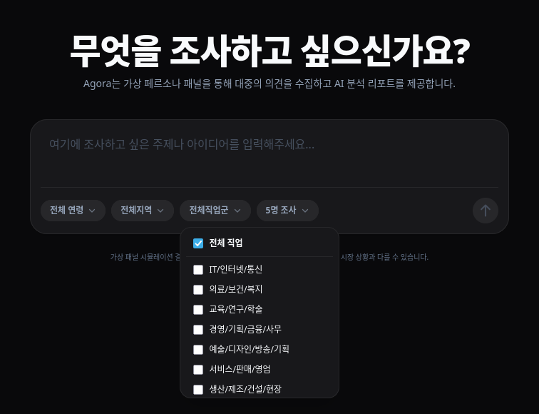
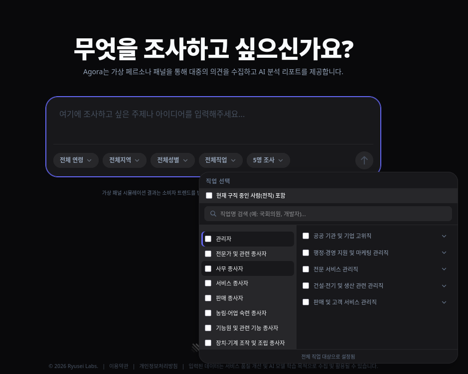

계속해서 [Agora](https://agora.ryuseilabs.com)를 개발하고 있습니다. 
Agora를 개발하고 테스트하던 와중에 발생한 문제점들과 이를 해결하는 과정을 써보려고 합니다.

#### 문제점 1: 특정 제품 또는 서비스의 이름을 언급하지 않으려고 한다.

---

"AI를 써보셨나요? 써보셨다면 어떤 서비스를 사용하셨나요?"라고 질문을 하면, 정상적인 답변은 "네, Chat GPT를 써봤어요."와 같은 식으로 대답할 거라고 예상했습니다. 
그런데, 막상 실제로 질문하면, "AI 써봤긴한데, 뭐 이것저것 써봤어요."와 같이 특정 제품, 서비스의 이름을 언급하지 않고 대답하는 경우가 많았습니다.  저 답변에 이어서 추가적인 질문으로 "정확히 어떤 걸 써봤어요?"라고 물어봐도, "아니, 뭐 딱히 정해놓고 쓰는 건 없어요. 그냥 인터넷에서 제일 잘 보이고, 쉬워 보이는 걸로 아무거나 쓰는 거죠."라고 언급을 피하는 경향을 보였습니다.

해당 문제가 발생하는 이유로는 질문에서나 생각 과정에서 특정 제품의 이름을 언급하지 않으니, 모델에서 제품의 이름을 모르고 대답을 회피하려는 것이라고 생각했습니다. 
따라서 사용자의 질문에 전처리를 하는 방식으로 내용을 보충하여 모델이 제품의 이름을 인지할 수 있도록 하여 임시로 이를 해결하였습니다.

추후에는 계속해서 바뀌는 시대의 흐름에 따라 서비스의 유행이나 점유율 같은 정보를 참고할 수 있도록하여 더욱 정확하고 유연하게 답변을 제공할 수 있도록 해야겠습니다.

#### 문제점 2: 자신의 배경과 상관없는 질문에도 너무나도 답변을 잘한다.

---

자신의 배경. 나이나 직업, 관심사에 관련 없는 질문에도 페르소나를 무시하고 답변을 하려고 하는 성격도 보였습니다. 
예를 들어, 80세 무직인 페르소나에게 자영업자를 위한 리뷰 관리 서비스를 설명해서 어떻게 생각하는지 물으면, "아이고, 그거 진짜 공감이에요. 저도 사업하면서 이것저것 나가는데, 솔직히 다 기억 못 하죠. 그런 거 딱 정리해주는 서비스 있으면 당연히 써보고 싶죠. 돈 아끼는 게 제일 중요하잖아요." 라며 실제로 자신이 자영업을 하는 중이 아님에도 마치 자신이 자영업을 하는 것처럼 답변을 했습니다.

이를 해결하기 위해서, 예전에 유행(?)했던 CoT(Chain of Thought) 방법을 적용하여 자신이 이 답변을 실제로 할 수 있는지, 자신과 이 답변이 얼마나 관련이 있는지를 혼자 생각하고 답변할 수 있도록 개선했습니다.

그렇게 고친 결과, 같은 질문에 대해서 "아이고, 저는 자영업자가 아니라서 그런 건 잘 모르겠네요. 그래도 주변에 가게 하시는 분들 보면 정말 힘들어하시더라고요. 그런 서비스가 있으면 좀 편해지려나요?" 라는 식으로 자신과 직접적인 연관이 없는 질문이면 제3자의 입장에서 답변을 하게 되었습니다.

#### 문제점 3: 문제점 2를 고치니 답변이 쓸데없어졌다.

---

Agora의 페르소나 데이터의 기반이 된 [Nemotron-Personas-Korea](https://huggingface.co/datasets/Nemotron-Personas-Korea)에는 대략 1,100여 개의 직업이 있고, 구직 중인 사람들의 전 직장까지 포함하면 대략 2,100여 개가 있습니다.

그래서 초기에는 아래 사진처럼 직업 필터링을 자체적으로 나눈 10개의 직업군으로만 선택할 수 있게 하고, 필터링된 데이터에서 무작위로 n개의 페르소나를 선택하여 답변을 생성했습니다.

하지만, 상단의 '문제점 2'를 고치고 나니, 니치마켓이나 전문성을 띠는 질문 등에서 대부분의 답변이 제3자의 입장으로 답변을 하게 되었습니다.
그래서 실제 수요가 있는 사람들의 답변을 듣기 위해 계속 같은 질문을 반복적으로 돌려야 하는 문제가 발생했습니다.

이를 해결하기 위해, [한국표준직업분류](http://kssc.kostat.go.kr/ksscNew_web/kssc/common/ClassificationContent.do?gubun=1&strCategoryNameCode=002&categoryMenu=007&addGubun=no)를 살짝 수정하여 모든 페르소나 데이터가 해당 분류에 들어갈 수 있게 하고, 필터링 로직을 직업군이 아닌, 한국표준직업분류의 대분류 중분류 소분류 세분류로 나누어서 아래처럼 더 세밀하게 직업을 필터링할 수 있게 했습니다.

#### 마무리

---

이처럼 아직 자잘한 문제가 많이 남아 있습니다.  
계속해서 문제를 찾고, 원인을 찾고, 수정을 해나가고 있긴 하지만, 이것만 반복하다 보면 결국 출시를 못 하겠다는 생각도 듭니다.

당분간은 테스트를 반복 할 것이지만, 조금씩은 출시 준비도 해야겠습니다.
VPS에 서비스를 올려서 돌리고 싶긴 한데, EC2도 예전처럼 1년 무료 같은 건 없어졌고, 오라클 A1은 계속해서 회원가입도 안 되고 있는지라, 일단은 홈서버에 세팅해 봐야겠습니다.

수요가 있을진 모르겠지만, 이런 거 만들면서 삽질하니 재밌긴 하네요.

삽질 좀 하다가 글 쓸만한 일이 생기면 또 끄적여보겠습니다.
