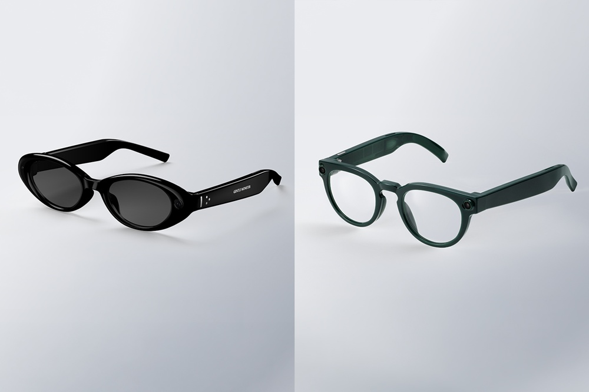
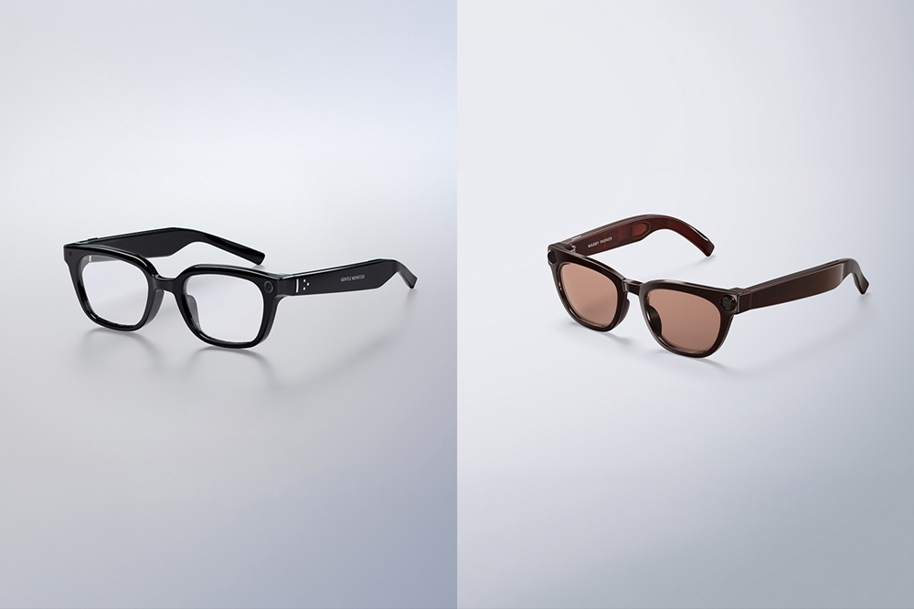
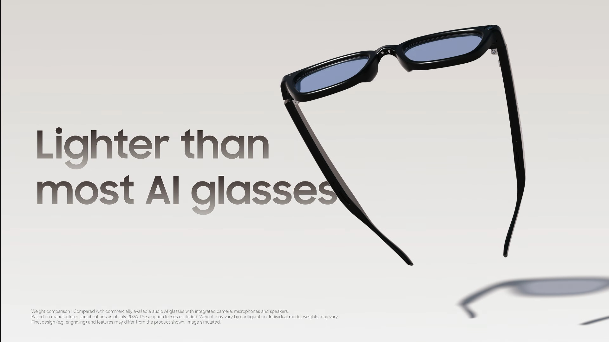
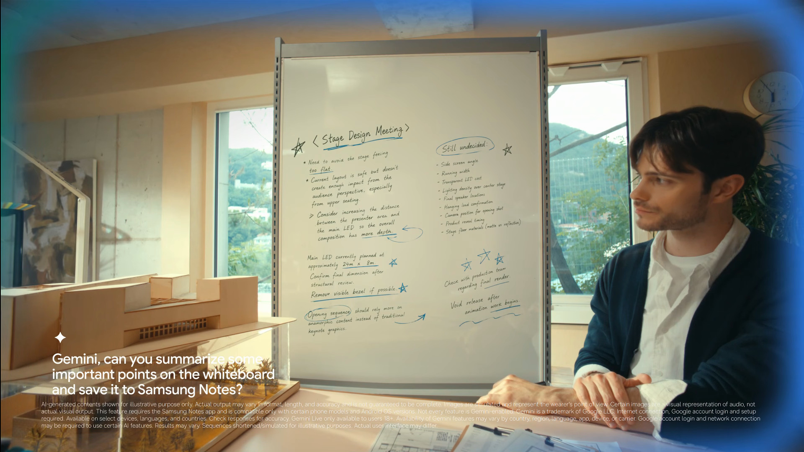
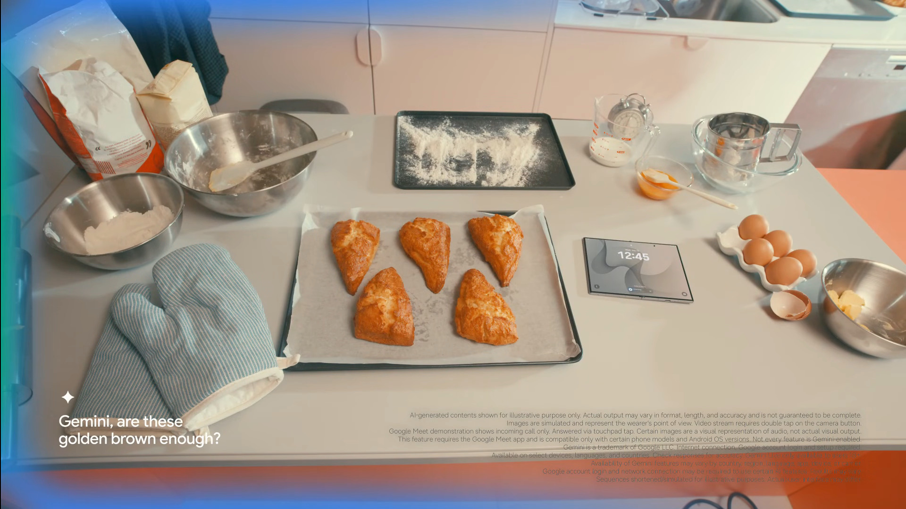
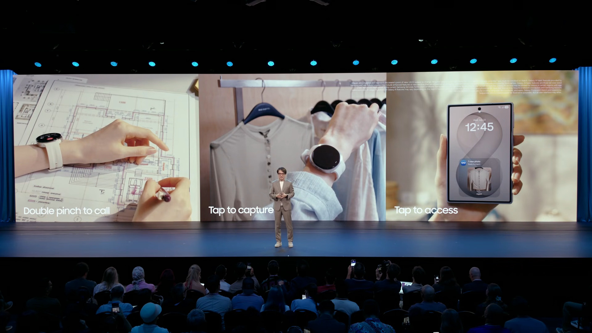

얼마 전인 7월 22일, 삼성 갤럭시 언팩 행사가 있었습니다. 
평소 신제품 공개 행사나 컨퍼런스를 챙겨보는 편이라 이번에도 온라인으로 시청했습니다. 새로운 폴더블 스마트폰이나 워치 등도 관심이 갔지만, 가장 기대했던 건 역시 글라스였습니다.  
스마트폰의 뒤를 잇는 차세대 기기가 될 것이라 생각해 평소 레이밴 메타나 Xreal 제품도 유심히 보고 있었는데요. 삼성에서도 개발 중이라는 소식과 함께 Google I/O 2026에서 잠깐 언급되었던 만큼 큰 기대를 안고 시청했습니다.

<i>"이번에는 출시 일정이 뜰 줄 알았는데 이번에도 안 뜨더라고요..."</i>

#### 이번에 나온 관련 정보

---

다른 기기보다는 비교적 짧게 글라스가 소개되었는데, 크게 디자인과 하드웨어, 소프트웨어 정도로 소개를 나눌 수 있었습니다.

##### 디자인

이전에 Google I/O 2026에서 이미 2가지 디자인이 공개되었는데, 이번에는 그 2가지 외에 2가지가 추가로 공개되었습니다. 그리하여 총 4개의 디자인이 확정되었습니다.

개인적으로는 2번과 3번 디자인이 마음에 들었습니다. 
1번과 3번은 젠틀몬스터에서, 2번과 4번은 워비파커에서 디자인을 했다고 하는데, 확실히 안경 회사에서 만드니 엔지니어가 디자이너를 이겨서 괴상한 디자인이 나오는 건 막은 것 같습니다.

##### 하드웨어

하드웨어 관련된 내용은 언팩 영상에서는 안 나온 것으로 보이는데, 삼성전자 뉴스룸의 [보도자료](https://news.samsung.com/kr/%ec%82%bc%ec%84%b1%ec%a0%84%ec%9e%90-%ec%9d%b8%ed%85%94%eb%a6%ac%ec%a0%84%ed%8a%b8-%ec%95%84%ec%9d%b4%ec%9w%a8%ec%9e%90-%ea%b3%b5%ea%b0%9c)를 보면 스냅드래곤 AR1 Gen1이 들어간 것으로 보입니다.  이 칩은 메타 레이밴에서도 사용하고 있는 칩인데, 2023년 10월에 공개되었고 후속 칩셋인 AR1+ Gen1이 2025년 6월에 이미 공개된 상태에서 AR1 Gen1을 탑재한다는 건 좀 의외였습니다.

그리고 메타 레이밴과 마찬가지로 카메라, 마이크, 스피커, 각종 센서들이 탑재된다고 합니다. 메타 레이밴 디스플레이와는 달리 이번 갤럭시 글라스에 당장은 디스플레이 버전은 출시되지 않을 것으로 보입니다.

배터리 타임도 최대 9시간으로 나름 넉넉하고, 충전 케이스 사용 시 최대 7회까지 추가 충전이 가능하다고 합니다. 아직 도수 안경을 완전히 대체하기는 어렵겠지만, 9시간 정도라면 일상에서 번갈아 가며 사용하기에 무리가 없어 보입니다.

또한, 무게가 가볍다고 하는데, 수치는 공개되지 않았지만 메타 레이밴보다 가벼운 걸로 알려져 있습니다.

##### 소프트웨어

소프트웨어는 개인적으로 AI 글라스에서 가장 핵심이라고 생각하는 요소인데요.
Android XR이 탑재된 만큼, 발표에서는 Gemini와의 연동 기능을 비중 있게 보여주었습니다.

위 이미지처럼 글라스 카메라에 인식된 화면을 Gemini가 요약하고, 이를 삼성 노트에 자동 저장하여 다른 기기에서도 바로 확인할 수 있게 해줍니다.

또한 Gemini Live를 활용해 글라스 카메라로 보이는 주변 상황을 인공지능이 실시간으로 이해하고 판단하는 모습도 보여주었습니다.

마지막으로 삼성 기기와의 연동을 보여주는데, 확실히 갤럭시 에코시스템을 강화하려는 것으로 보입니다.

#### 개인적인 생각

---

기존에는 Android XR 탑재 기기가 Galaxy XR 정도로 유일해서, 너무 비싸기도 하고 사용자도 적다 보니 이러다 묻히는 게 아닌가 싶었습니다. 그 와중에 Android XR을 탑재한 다른 기기가 나와서 다행이라고 생각합니다.
메타 레이밴과는 다르게 Android XR은 다른 제조사들에서도 많이 탑재할 것으로 보이고, 그러다 보면 이쪽 시장도 꽤나 커질 것으로 보입니다.

다만 갤럭시 스마트폰 사용자 위주의 연동성이다 보니, 다른 스마트폰을 쓰는 입장에서는 공개된 기능만으로 반쪽짜리가 되지 않을까 싶습니다. 아울러 당장 디스플레이 버전이 나오지 않는다는 점도 아쉬움으로 남습니다. 음성으로 알려주는 것도 물론 좋다고 생각은 하지만, AI 글라스의 최종 진화형은 XR(확장현실)이라고 생각합니다. 이를 위해서는 디스플레이가 필수 아닐까요...

결론적으로, 이런 AI 글라스 시장에 뛰어드는 기업들이 많아서 좋다고 생각합니다. 애플도 글라스 소식이 있던데, 스마트폰에서의 경쟁이 글라스 시장으로 확장되는 느낌입니다. 아직 극초기의 제품이기에 앞으로의 발전이 기대되기도 하고, 언젠가는 진짜 스마트폰을 대체할 수도 있겠다는 생각도 들었습니다.

다음 신제품 공개 행사로는 8월 12일에 Made by Google 2026이 예정되어 있는데, 개인적으로 구매를 고려하는 제품들이 많아서 기대가 됩니다. 해당 행사가 끝난 후 관련 소식도 글을 남겨보겠습니다.
